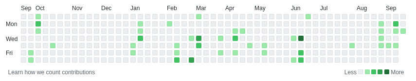

# random-diffs
Out of context snippets of code

## Context

It's been 2 years that I am working almost exclusively on proprietary software, and this is making
my Github's contributions map super inactive.

I know that having a green / healthy Github's contribution map is a silly goal to have in life,
but at the same time it is a **statement**. A person with many code contributions is a person
that is publishing code, useful or not, relevant or not. To have a green github map is like 
going out on the streets with a FSF (or Red Cross, or Greepeace, or Bitcoin, insert your ethical
model of group here) t-shirt, is a **sign**, it is a tribe credential. A green Github contributions
map tells a story about a person, it summarizes that the owner of a github account is an open 
source contributor, it is someone that likes to share source code with the world.

Working fulltime for a company that is suportive of open source, but that dont have the resources to 
properly open most of it's code, can be frustrating, but the path for developing in the open 
dont have to be all or nothing. I understand that switching huge codebases from proprietary/unethical
to free-software is an overhead, it involves selling the value of openess to a large number of people,
it is a cultural battle, long and difficult.

Starting new greenfield projects in the open from day one is easier, but it is not everyday that
we have oportunities to start new projects, specially with pressing bugfixes of legacy codebases
in the urgency of everyday business.

Another alternative for a Free Software engineer working on a proprietary code company, is to make
all her contributions be generic importeable libraries that can be used to implement features, or to
fix issues. But again, this is a big overhead.

On feedback sessions with one of my directors, I remember stating my frustration of not working on
ethical/free-software codebases, and the response I was given was something in the lines of:

> But Fabricio, no one here is forbidding you to work on open source...

So this repository is a naive attempt to "open source" my daily small and non-secret-revealing
contributions to proprietary codebases in an "anonimized" fashion. Just to paint my tiles.

I believe that 100% of the code in this repo is not useful at all, there is no super secret inovative
groudbreaking patenteable algorithm in here, just simple and boring snippets that could be published
on any other website, like Stack Overflow answers. So although they are original and written by me
I really wont be sad if the AGPL license I posted them under is disrespected.

## Acknowledgements

Thanks again for my employers for letting me paste parts of my daily secret contributions open in 
Github under a free license!! It means a lot to me :)
